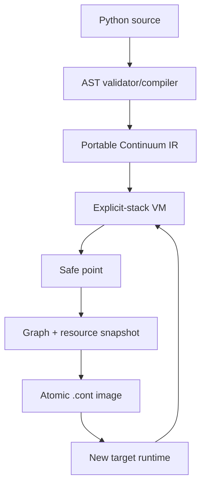

# Architecture

## Scope

Version 0.2 executes a controlled subset of Python 3.12.13. The application
source is not edited by its author, but `continuum run` compiles it before
execution. Suspension occurs only at Continuum `SAFEPOINT` instructions. IR
0.3 places them after statements, after `for` iterator advancement and target
binding, before loop back edges/continues, and at finally-body entry.

This architecture restores a Continuum language-level continuation. It does
not serialize ordinary `PyFrameObject` values and does not claim to migrate a
normal CPython PID.

## Data path

### Compile

`compiler.py` parses source with Python's `ast` module. It either emits the
small Continuum instruction set or rejects a node with a filename and line.
Functions become named IR blocks. Calls to a supported Python function push a
new Continuum `Frame`; they do not recurse through a native CPython frame for
the duration of the function.

Positional default expressions execute once, from left to right, when the
`def` statement runs. `MAKE_FUNCTION` captures the resulting portable values
in the Continuum function object. Calls bind omitted trailing positional
parameters from that stored tuple. Mutable defaults therefore retain identity
and mutations across calls and checkpoints, matching Python's definition-time
semantics.

### Execute

Each active frame contains:

| Field | Meaning |
| --- | --- |
| `function_id` | Stable reference into bundled IR |
| `pc` | Index of the next logical instruction |
| `locals` | Function-local object graph roots |
| `stack` | Language operand/value stack |
| `blocks` | Active `try/finally` and `try/except` handlers |
| `finally_reasons` | Normal or exceptional pending control state |

The VM also owns module globals, program arguments, instruction counters,
safe-point counters, the module-level `random` state, and a resource manager.

`SAFEPOINT` first increments `pc`, then checks for a freeze request. Therefore
the statement before it is complete and is not replayed after restore. A
requested freeze that encounters an unsupported live object fails; execution
continues and the CLI receives an error.

Safe points are not inserted between arbitrary expression opcodes or inside
host calls. Caller operand stacks may nevertheless be nonempty while a nested
Continuum function is active; those values are stored in the frame graph.

### Serialize

The heap codec uses explicit tags and numeric object IDs. Mutable containers
are allocated before their children are decoded, which preserves shared
references and cycles through lists, dictionaries, and sets. Supported
immutable values, portable iterators, Continuum function/callable references,
random generators, exceptions, and file resource references have dedicated
records.

Encoding is followed by a decode preflight before the destination is created,
so the source cannot exit after committing a graph already known to be
unresumable. There is no `pickle.loads()` path. Unknown types and unknown tags
fail closed. User-defined classes are not yet supported.

### Rebind resources

Only read-only regular files are supported:

- `strict`: same path, size, mtime, and SHA-256;
- `relocate`: mapped path, size, and SHA-256;
- `bundle`: bytes stored in `resources/files/` and rebound to an in-memory
  binary or text stream.

The exact stream offset is restored. A mismatch aborts resume.

### Commit and terminate

The source runtime snapshots and preflights all state, writes a complete
temporary ZIP, fsyncs it, atomically renames it, writes an atomic response
record, and only then raises the internal `FrozenExecution` signal. The source
process exits normally. A partial image is never reported as successful.

If capture fails, the VM is left live. Request/response control files are
removed by the client so a corrected retry can succeed.

## Why not CPython frames

In CPython 3.11 and later, `PyFrameObject` members are no longer public C API.
The executing state primarily lives in private `_PyInterpreterFrame`
structures whose layout, stack representation, instruction pointer, ownership,
and linkage can change between releases. Even a fork that captures those
structures must translate all referenced `PyObject` values, exception state,
generators, native calls, and C-extension resources; raw pointers and a native
C stack cannot be placed in a cross-architecture image.

A controlled CPython fork remains a possible long-term route to greater
language compatibility, but it is not the smallest way to prove an honest
portable continuation.

## Trust boundary

A `.cont` image is executable content. Loading validates container names,
entry counts, expanded sizes, compression ratios, checksums, versions,
allowlisted modules, IR opcodes, jump targets, and heap tags before execution.
The VM still runs program logic with the invoking user's authority. Integrity
is not authenticity; image signatures are not implemented.

See [SECURITY.md](SECURITY.md) and [FORMAT.md](FORMAT.md).
